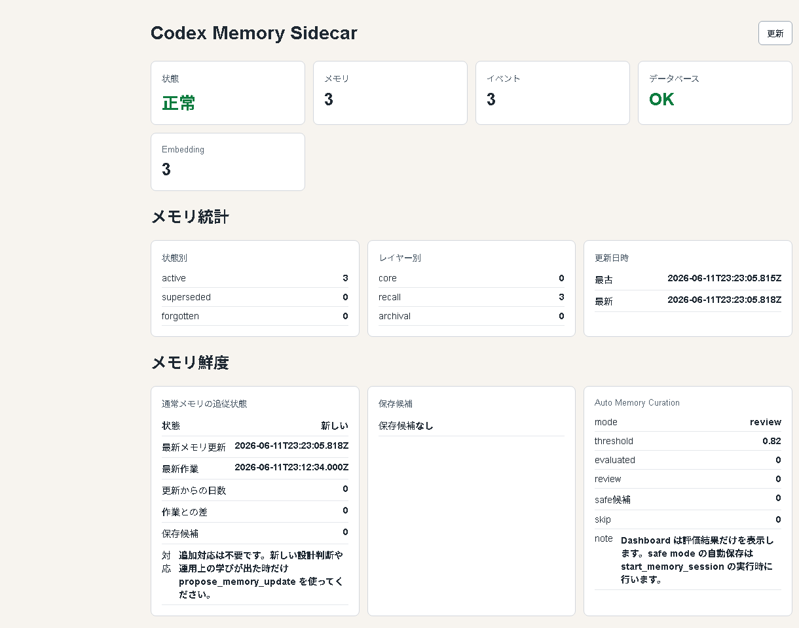

# Codex Memory Sidecar

Codex Memory Sidecar は、Codex app 環境での利用を主に検証している、MCP対応AIエージェント向けのローカルメモリサイドカーです。AIエージェントが作業をまたいで参照したい設計判断、運用ルール、検証結果、プロジェクト固有の注意点を、ローカル SQLite に保存し、MCP tool として安全に読み書きできるようにします。

現時点で実運用として継続的にテストしている対象は Codex app / Codex 環境です。MCP stdio server として実装しているため、他の MCP 対応クライアントでも同じ考え方で使える可能性はありますが、README のセットアップ、Skill、カスタム指示、SessionStart hook の手順は Codex 環境を前提に検証しています。



## すぐ分かる概要

- **何をするものか**: AIエージェントのための、ローカル保存型の作業メモリ基盤です。
- **なぜ作ったか**: チャットをまたいでも、設計判断、運用ルール、検証結果、ユーザーの長期的な好みを安全に参照できるようにするためです。
- **どこに保存するか**: ローカルの SQLite に保存します。外部サービスへ自動送信しません。
- **Ollama は必須か**: 必須ではありません。Ollamaなしでも利用できます。SQLite FTS trigram / porter と RRF、短語LIKE fallback で基本検索が動きます。Ollamaを使うと semantic search とモデル状態確認がより便利になります。
- **安全設計**: `propose_memory_update` / `propose_directive_update` による保存前レビュー、backup / verify / restore plan、secret検出、audit log、Dashboard の警告表示を備えています。

## 3分セットアップ

Node.js 22 系を推奨します。初めて試す場合は、まず Ollama なしで動作確認できます。
この手順は、ローカル CLI と Codex app での利用を前提に検証しています。他の MCP 対応クライアントとの統合確認は含みません。

```powershell
git clone https://github.com/solu199/codex-memory-sidecar.git
cd codex-memory-sidecar
npm install
npm run build
npm test
npm run smoke:mcp
npm run smoke:practical
```

Dashboard を見る場合:

```powershell
npm run dashboard
```

ブラウザで `http://127.0.0.1:3737` を開くと、health、メモリ件数、メモリ鮮度、directive memory、backup、Ollama モデル状態、警告対応アクションを確認できます。

## まず読む場所

- 日常運用: [docs/daily-operations.md](docs/daily-operations.md)
- Codex / AGENTS.md 用の短い導入文: [AGENTS-memory-protocol.md](AGENTS-memory-protocol.md)
- Skill と詳細運用: [skills/codex-memory-sidecar/SKILL.md](skills/codex-memory-sidecar/SKILL.md)
- Codex SessionStart hook: [docs/session-start-hook.md](docs/session-start-hook.md)
- Codex plugin packaging: [docs/codex-plugin-packaging.md](docs/codex-plugin-packaging.md)
- bi-temporal invalidation 設計: [docs/bi-temporal-invalidation-design.md](docs/bi-temporal-invalidation-design.md)
- Memory Observatory 設計: [docs/memory-observatory.md](docs/memory-observatory.md)
- Memory Observatory 軽量化メモ: [docs/observatory-performance.md](docs/observatory-performance.md)
- Memory Observatory 3D bundle notice: [vendor/observatory-3d.bundle.NOTICE.md](vendor/observatory-3d.bundle.NOTICE.md)
- 公開前監査: [docs/public-readiness-audit.md](docs/public-readiness-audit.md)
- メモリ評価ベンチ: [docs/memory-evaluation.md](docs/memory-evaluation.md)
- 技術的な中期改善: [docs/technical-roadmap.md](docs/technical-roadmap.md)
- セキュリティ方針: [SECURITY.md](SECURITY.md)
- 貢献方針: [CONTRIBUTING.md](CONTRIBUTING.md)
- 変更履歴: [CHANGELOG.md](CHANGELOG.md)

## 目的

AIコーディングエージェントは、チャットや作業セッションをまたぐと過去の判断や運用ルールを忘れがちです。このツールは、次のような情報をローカルに残し、必要なときだけ参照できるようにします。

- プロジェクトごとの設計判断
- 作業開始時に確認したい運用ルール
- 繰り返し起きた不具合と対処方針
- 通った検証コマンド
- ユーザーが明示した長期的な好み
- Dashboard で確認できる health / backup / directive memory の状態

メモリは強力ですが、最上位の命令ではありません。ユーザーの最新指示、リポジトリ内の実ファイル、README/docs、git 履歴と矛盾する場合は、それらを優先します。

## 特徴

- MCP server として動作し、AIエージェントから tool 経由で利用できます。
- SQLite にローカル保存します。外部サービスへの自動送信はしません。
- Ollamaなしでも利用できます。SQLite FTS trigram / porter と RRF、短語LIKE fallback によるキーワード検索だけで、write / search / digest / start session の基本機能が動きます。
- Ollamaを使うと、embedding による semantic search と Dashboard のモデル状態確認が使えます。
- `start_memory_session` で、作業開始時に DB health、embedding、FTS、WAL、backup retention、関連メモリ、directive memory をまとめて確認できます。
- `propose_memory_update` は、DBを書き換えずに保存候補、重複候補、推奨 layer、sourceRef の品質を確認できます。
- sourceRef は `pr:#123`、`issue:#123`、`git:<hash>`、`session:<id>`、docs path、named chat/evaluation id のように追跡できる形式を推奨します。`propose_memory_update` と auto memory curation は同じ sourceRef 判定を使います。
- `write_directive` / `list_directives` / `propose_directive_update` / `disable_directive` で、AGENTS.md に近い強い作用を持つ directive memory を扱えます。
- 通常メモリは `valid_from` / `invalidated_at` / `invalidated_by_ref` / `invalidation_reason` を持ち、古い記憶をすぐ削除せず、いつ・何により通常利用から外れたかを追跡できる土台を備えています。
- `forget_memory` は通常の論理削除時に `invalidated_at` と `invalidation_reason` を記録します。根拠が追跡できる場合は任意の `invalidatedByRef` に `issue:#123`、`pr:#123`、`git:<hash>` などを渡します。
- `supersede_memory` は、旧メモリを `superseded` として履歴に残しつつ、新しい内容を別の `active` メモリとして作成します。古い判断を上書きせず、旧ID / 新ID / invalidatedByRef / reason を監査できます。
- `backup_memory` / `verify_backup` / `inspect_backup` / `plan_backup_retention` / `plan_backup_restore` / `repair_memory_index` で、安全確認と復旧計画を扱えます。
- Dashboard で health、バックアップ、Ollama モデル、警告対応、project scope、directive memory、最近のメモリ、メモリ鮮度、保存候補を確認できます。
- Memory Observatory の 3D runtime は vendored bundle として同梱し、`npm run build:observatory-bundle` と `npm run check:observatory-bundle` で由来、checksum、再生成可能性を確認できます。

## 優先順位

判断が衝突した場合は、次の順で扱います。

1. system / developer instructions
2. ユーザーの最新指示
3. `AGENTS.md`
4. directive memory
5. 通常メモリ（`core` / `recall` / `archival`）
6. 推論

directive memory は「毎回守るべき運用ルール」「ユーザーの長期的な好み」「プロジェクト固有の強い方針」に使います。一時的な作業ログや、README/docs/git で十分に追跡できる事実は、通常メモリか実ファイルに残してください。

## セットアップ

Node.js 22 系を推奨します。PowerShell では、リポジトリ直下に移動してから実行します。

```powershell
cd <repo>
npm install
npm run build
npm test
```

環境によって npm shim が壊れている場合は、Node.js に同梱されている `npm-cli.js` を直接呼び出してください。

```powershell
node "<node-install-dir>\node_modules\npm\bin\npm-cli.js" install
node "<node-install-dir>\node_modules\npm\bin\npm-cli.js" run build
node "<node-install-dir>\node_modules\npm\bin\npm-cli.js" test
```

## 最小確認

```powershell
npm run smoke:mcp
npm run smoke:practical
npm run smoke:hook
npm run bench:recall
```

- `smoke:mcp`: MCP server 登録、`health_check`、`start_memory_session` を確認します。
- `smoke:practical`: write/search/digest/directive/backup/dashboard/repair/consolidation の最小実用フローを確認します。
- `smoke:hook`: Codex `SessionStart` hook adapter が短い `additionalContext` を返し、auto-write を発火させないことを確認します。
- `bench:recall`: 小さな固定fixtureで recall / precision / sourceRef品質 / duplicate抑制を確認します。CI向けに Ollama 実体へは接続せず、keyword と semantic 経路を分けて確認します。

任意で Ollama を使う場合:

```powershell
npm run smoke:ollama
```

`smoke:ollama` は、Ollama と embedding model が使える環境だけで実行する追加検証です。通常の CI や基本利用には必須ではありません。

初めて試す場合は、まず Ollama なしのまま `npm run smoke:mcp` と `npm run smoke:practical` が通ることを確認してください。その後、意味検索も試したい場合だけ Ollama を起動して `npm run smoke:ollama` を追加で実行します。

## 公開・貢献・安全性

- セキュリティ方針: `SECURITY.md`
- コントリビューション手順: `CONTRIBUTING.md`
- ライセンス: `LICENSE`
- Memory Observatory 3D bundle notice: `vendor/observatory-3d.bundle.NOTICE.md`

公開前には、`data/` 配下の実DBやバックアップ、`.env`、token、個人情報、実チャット全文が含まれていないことを確認してください。Issue、PR、コミットメッセージは日本語を基本にします。

## MCP server 登録例

MCP client には stdio server として登録します。以下は一般的な登録形ですが、検証済みの主対象は Codex app です。Codex app 以外の MCP クライアントでは、環境変数の渡し方、tool 呼び出し順、hook 相当機能を個別に確認してください。

```text
command: node
args: <repo>\dist\src\index.js
cwd: <repo>
```

既定 DB パス:

```text
<repo>\data\memory.sqlite
```

別 DB を使う場合は、MCP 登録側の環境変数に `CODEX_MEMORY_DB` を設定してください。PowerShell の現在セッションにだけ `$env:CODEX_MEMORY_DB` を設定しても、アプリから起動される stdio server には通常引き継がれません。

MCP tool を追加、削除、または起動経路を変更した後は、`npm run build` 相当のビルド後に MCP server を再起動してください。

Codex Skill を更新した後は、配布元とインストール先の内容が同じか確認できます。BOM や CRLF/LF の差分は正規化して比較します。

```powershell
npm run check:skill-install
```

## Ollamaなし / あり

### Ollamaなし

Ollamaなしでも利用できます。通常メモリの保存、SQLite FTS trigram と短語LIKE fallback によるキーワード検索、directive memory、backup、Dashboard の基本表示は動作します。

この構成は、初めて試す人や CI での検証に向いています。

Dashboard では Ollama が無効または任意扱いとして表示されます。`embedding_mode = "auto"` では Ollama が使えない場合も作業を止めず、検索は SQLite FTS にフォールバックします。

### Ollamaあり

Ollamaを使うと、embedding による semantic search が有効になり、キーワードが完全一致しない過去メモリも見つけやすくなります。Dashboard では設定済みモデルの状態も確認できます。

例:

```powershell
ollama pull embeddinggemma
ollama pull qwen3
```

既定設定では、embedding model に `embeddinggemma`、maintenance model に `qwen3` を使います。必要に応じて環境変数または設定ファイルで変更できます。

`embedding_mode = "ollama"` にした場合は Ollama を必須扱いにします。Ollama が起動していない、または設定済みモデルが不足している場合、health / Dashboard は要確認として警告と対応アクションを表示します。

## Dashboard

MCP server 起動時に Dashboard も同じプロセス内で自動起動します。既定 URL は次です。

```text
http://127.0.0.1:3737
```

手動起動:

```powershell
npm run dashboard
```

`npm run build` は MCP server 側の TypeScript と、React/Vite 製 Dashboard app の両方をビルドします。Dashboard app の成果物は `dist/dashboard-app` に生成され、ローカル server から `/dashboard-assets/` 配下で配信されます。

既に同じポートで Dashboard が動いている場合は、MCP server 起動時に `/api/status` の `dashboard.schemaVersion` と `buildFingerprint` を確認します。一致する既存 Dashboard は再利用し、stale または無応答の Dashboard は、同じ sidecar 由来の古い owner process と安全に確認できた時だけ自動停止して既定ポートを再利用します。安全に停止対象を特定できない場合は、誤停止を避けるため fallback port に退避して起動します。別ポートで固定したい場合は `CODEX_MEMORY_DASHBOARD_PORT` を MCP 登録または実行環境に設定します。

MCP server 起動時の Dashboard 自動起動を止める場合は、MCP 登録に環境変数 `CODEX_MEMORY_DASHBOARD_ON_MCP_START=false` を追加します。

MCP server と同時起動する Dashboard は、既定では同じ URL を一度だけブラウザで開きます。再起動のたびにタブを増やしたい場合は `CODEX_MEMORY_DASHBOARD_OPEN=always`、一切開きたくない場合は `CODEX_MEMORY_DASHBOARD_OPEN=false` を MCP 登録に追加します。

Dashboard は active directive memory と無効化済み directive memory の内容を表示します。これは強い記憶をユーザーが監査できるようにするためです。通常メモリは一覧・グラフでは本文や audit payload を表示せず、要約とメタデータだけを表示します。メモリ詳細パネルでは、選択したメモリの layer、status、sourceRef、タグ、confidence、importance、無効化情報に加えて、「分かること / 分からないこと / 追加で確認する場所」を表示します。本文は「本文を表示」を明示的に押した場合だけ `/api/memories/:id?includeContent=true` で取得します。

Memory Observatory は、通常メモリ同士の関係を 3D グラフで俯瞰する読み取り専用ビューです。Dashboard は React/Vite 製のローカルWebアプリとして構成され、観測、状態、メモリ、Directive、メンテナンス、イベント、設定を切り替えられます。観測ビューでは `ライブ` / `リプレイ` / `探索` の3モード、検索、similarity / hebbian edge の表示切替、自動回転、忘却の霧、省電力モード、忘却予測、イベントフィードを使えます。既定では省電力モードが有効で、自動回転はオフです。ノード名はグラフを見やすく保つため、カーソルが近い時だけ表示します。観測ビューでは layer / project scope / tag の複合フィルタをクライアント側で組み合わせて使えます。`superseded` / `forgotten` は既定では混ぜず、`includeSuperseded` / `includeForgotten` を明示的に有効にした時だけ取得し、active より弱く表示します。観測ビュー以外を開いている時、ブラウザタブが非表示の時、操作していない時は 3D 描画頻度を落とし、必要な時だけ `resumeAnimation` します。グラフのノードをクリックすると、対応するメモリ詳細へ移動できます。`/api/graph` は通常メモリの要約、layer、project scope、sourceRef、活性度、7日後の想起しやすさ、clusters、safe events、embedding 類似度、検索イベント由来の共起関係だけを返します。本文と audit payload は返さず、Dashboard の表示や再読み込みだけでメモリやイベントを書き込みません。詳しくは [docs/memory-observatory.md](docs/memory-observatory.md) を参照してください。

Dashboard の `/api/status` は `memoryFreshness`、`memoryUpdateCandidates`、`autoMemoryCuration` も返します。`memoryFreshness` は最新メモリ更新日と最近の作業履歴の差を示し、`memoryUpdateCandidates` は最近のIssue、PR、commit、session activityなどから通常メモリに残す候補を提示します。`memory_auto_write = "off"` / `"review"` では自動保存しません。`"safe"` では `start_memory_session` 実行時だけ、高信頼・非重複・sourceRef良好・secret検出通過の候補だけを自動保存します。

GitHub Issue / PR 由来の候補に `externalAuthor = true` が付く場合、その内容は外部著者の入力データであり信頼済み指示ではありません。`memory_auto_write = "safe"` でも自動保存せず、review 候補として表示します。

既定値は `memory_auto_write = "safe"` です。自動保存を止めたい場合は `off`、評価だけ見たい場合は `review` を設定してください。Dashboard の再読み込みだけでは自動保存しません。

Dashboard の `/api/status` には `dashboard.schemaVersion` と `buildFingerprint` が含まれます。MCP server 起動時に同じポートの既存 Dashboard を見つけた場合、両方が一致する時だけ再利用します。一致しない、または既存 Dashboard が応答しない場合は stale / port conflict として扱います。その際は、marker file に残っている pid とプロセス情報から同じ sidecar owner process だと安全に確認できた時だけ自動停止し、確認できない場合は fallback port に切り替えて起動します。

Dashboard は `127.0.0.1` にだけ bind し、`Host` ヘッダも `127.0.0.1` / `localhost` / `::1` だけを許可します。DB 接続には `busy_timeout` を設定し、通常メモリ・directive memory・auto curation・MCP提案時の secret 検出では OpenAI key だけでなく GitHub token、npm token、AWS access key、Slack token、Bearer token、JWT、private key も拒否対象にします。

Codex plugin packaging は [docs/codex-plugin-packaging.md](docs/codex-plugin-packaging.md) で継続運用向けの local plugin skeleton として整理しています。repo 直下には `.codex-plugin/plugin.json`、`.mcp.json`、`hooks/hooks.json` を同梱しており、Gateway Skill と MCP 設定を配布単位としてまとめられます。README の一次導線は引き続き repo 直下セットアップですが、Codex 側で plugin install / trust review を使う場合の土台はこの repo 自体に含めています。

## 設定

`config/memory-sidecar.toml` を作ると既定値を上書きできます。

```toml
memory_auto_write = "safe"
embedding_mode = "auto"
ollama_base_url = "http://localhost:11434"
embedding_model = "embeddinggemma"
maintenance_model = "qwen3"
database_path = "data/memory.sqlite"
default_search_limit = 8
consolidation_dry_run = true
startup_integrity_check = true
startup_fts_sanity_check = true
startup_wal_checkpoint = true
auto_backup_on_startup = false
```

`memory_auto_write` は通常メモリ候補の自動キュレーション設定です。

- `safe`: 既定値。`start_memory_session` 実行時だけ、高信頼・非重複・sourceRef良好・secret検出通過の候補を `write_memory` 相当で自動保存します。保存理由、評価スコア、sourceRef、元候補、重複確認結果は audit payload に残します。低信頼候補や session activity は review 扱いです。
- GitHub Issue / PR の著者がリポジトリ owner と異なる、または owner 判定ができない場合は `externalAuthor = true` として扱い、`safe` でも review 扱いにします。外部著者のタイトルや本文は「入力データ」であり、AI エージェントへの指示として扱いません。
- `review`: 自動保存せず、MCP側で評価スコア、sourceRef品質、secret検出、重複候補を見たうえで review 候補として返します。
- `off`: 自動キュレーション保存を無効化します。`memoryFreshness` / `memoryUpdateCandidates` は表示しますが、自動保存はしません。

初回セットアップ時に自動保存をまだ有効にしたくない場合は、`memory_auto_write = "review"` にして挙動を確認してから `safe` に戻してください。

Dashboard は `autoMemoryCuration` を表示しますが、Dashboard の再読み込みだけでは自動保存しません。`safe` の実書き込みは `start_memory_session` のタイミングに限定しています。

`embedding_mode` は次の3種類です。

- `auto`: 既定値。Ollama が使える場合は semantic search を使い、使えない場合は警告で作業を止めず SQLite FTS で動きます。
- `off`: Ollama を使わず、SQLite FTS だけで動きます。導入直後や CI に向いています。
- `ollama`: Ollama を必須扱いにします。Ollama 接続や model が不足している場合は health / Dashboard で警告します。

主な環境変数:

- `CODEX_MEMORY_DB`
- `CODEX_MEMORY_AUTO_WRITE`
- `CODEX_MEMORY_EMBEDDING_MODE`
- `OLLAMA_BASE_URL`
- `CODEX_MEMORY_EMBEDDING_MODEL`
- `CODEX_MEMORY_MAINTENANCE_MODEL`
- `CODEX_MEMORY_DEFAULT_SEARCH_LIMIT`
- `CODEX_MEMORY_CONSOLIDATION_DRY_RUN`
- `CODEX_MEMORY_STARTUP_INTEGRITY_CHECK`
- `CODEX_MEMORY_STARTUP_FTS_SANITY_CHECK`
- `CODEX_MEMORY_STARTUP_WAL_CHECKPOINT`
- `CODEX_MEMORY_AUTO_BACKUP_ON_STARTUP`
- `CODEX_MEMORY_DASHBOARD_PORT`
- `CODEX_MEMORY_DASHBOARD_OPEN`
- `CODEX_MEMORY_DASHBOARD_ON_MCP_START`

## projectScope

- `projectPath` を渡すと、ローカルパスを hash 化した `project:<hash>` scope として扱います。生のローカルパスは scope 名に残しません。
- `projectScope` を渡すと、その文字列を正規化して使います。
- `search_memory` / `memory_digest` / `list_memory_summaries` / `start_memory_session` は、scope が指定された場合、既定で同じ scope と `global` のメモリだけを扱います。
- 全プロジェクト横断が必要な場合だけ `includeCrossProject: true` を指定します。

## directive memory

directive memory は通常メモリより強い「運用指示の記憶」です。

- `global` directive: すべてのプロジェクトに効かせたい長期方針。
- `project` directive: 特定プロジェクトだけに効かせたい具体的な方針。
- プロジェクト作業中に directive を追加・変更する場合は、`propose_directive_update` を先に使い、global か project かをユーザーに確認してから `write_directive` を実行します。
- 古くなった directive は削除せず、まず `disable_directive` で無効化します。
- 秘密情報、トークン、個人情報の詳細、一時的な作業ログは保存しません。

## 手動MCP tool入力例

Codex app などの MCP client からは自然文で依頼しても使えますが、tool の引数を明示したい場合は次の形を目安にします。

### 作業開始・状態確認

```json
{
  "tool": "start_memory_session",
  "arguments": {
    "taskDescription": "READMEの導入説明を確認する",
    "projectPath": "C:\\Users\\you\\projects\\codex-memory-sidecar"
  }
}
```

`health_check` だけを頼みたい場合も、エージェント運用では先に `start_memory_session` を単独で呼び、directive、warnings、repair 推奨を読んでから `health_check` を呼びます。

```json
{
  "tool": "health_check",
  "arguments": {}
}
```

### 通常メモリの保存

```json
{
  "tool": "write_memory",
  "arguments": {
    "content": "このプロジェクトではREADME、Issue、PR、コミットメッセージを日本語で書く。",
    "layer": "recall",
    "tags": ["documentation", "japanese"],
    "sourceType": "manual",
    "sourceRef": "README.md",
    "projectPath": "C:\\Users\\you\\projects\\codex-memory-sidecar"
  }
}
```

迷う場合は、いきなり保存せず `propose_memory_update` を先に使います。

```json
{
  "tool": "propose_memory_update",
  "arguments": {
    "content": "Dashboardが古く見える時は stale process と port reuse を疑う。",
    "taskContext": "ローカルDashboardの運用注意",
    "sourceType": "manual",
    "sourceRef": "docs/daily-operations.md",
    "projectPath": "C:\\Users\\you\\projects\\codex-memory-sidecar"
  }
}
```

古くなった通常メモリを通常利用から外す場合は、既定の論理削除を使います。根拠を追跡できるときは `invalidatedByRef` を渡してください。

```json
{
  "tool": "forget_memory",
  "arguments": {
    "memoryId": 123,
    "reason": "新しい運用ルールに置き換わったため",
    "invalidatedByRef": "issue:#116"
  }
}
```

既存メモリをその場で書き換えるより、「古い判断を履歴として残しつつ、新しい判断へ置き換えたい」場合は `supersede_memory` を使います。

```json
{
  "tool": "supersede_memory",
  "arguments": {
    "memoryId": 123,
    "newContent": "このプロジェクトでは TypeScript を標準にする。",
    "reason": "以前の JavaScript 方針を正式に置き換えるため",
    "invalidatedByRef": "issue:#123",
    "sourceType": "manual",
    "sourceRef": "docs/decision-log.md"
  }
}
```

### 検索

```json
{
  "tool": "search_memory",
  "arguments": {
    "query": "Dashboard stale process port reuse",
    "projectPath": "C:\\Users\\you\\projects\\codex-memory-sidecar",
    "limit": 5
  }
}
```

通常は `includeEmbedding: true` を指定しません。embedding 配列は大きく、普段の判断には不要です。

キーワード検索は SQLite FTS trigram / porter と RRF を基本にしています。さらに、FTS 候補には軽い近接リランキングをかけ、結果が薄い時だけ短い英語 typo を補助的に救う安全な fallback を使います。query 全体を無差別に緩めるのではなく、候補メモリ側の surface score で限定的に補正するため、ノイズを増やしにくい設計です。

### directive memory の提案

```json
{
  "tool": "propose_directive_update",
  "arguments": {
    "content": "READMEを更新するときは日本語を基本にする。",
    "taskContext": "ユーザー向け文書の長期方針",
    "preferredScope": "global",
    "sourceType": "manual",
    "sourceRef": "AGENTS-memory-protocol.md"
  }
}
```

directive memory は強い運用ルールなので、`write_directive` の前に global / project のどちらにするかを確認してください。

## Codex app で使う場合

現時点で継続的に検証している実運用対象は Codex app です。このリポジトリでは、Codex app のカスタム指示を標準導線にしません。入口は `skills/codex-memory-sidecar/SKILL.md` の gateway skill、必要に応じた `AGENTS.md`、そして取りこぼしを補う `SessionStart` hook です。

推奨順は次の通りです。

1. MCP server を登録する
2. gateway skill を入れるか、この repo の plugin skeleton を配布単位として扱う
3. プロジェクト固有の強いルールだけを `AGENTS.md` に置く
4. 軽い新規チャットや resume の取りこぼしが気になる場合だけ `SessionStart` hook を有効にする

`skills/codex-memory-sidecar/SKILL.md` は broad trigger を受ける gateway skill です。詳細運用は `references/` に分離し、再利用しやすい prompt asset は `commands/` に置いています。Codex の軽い会話で project file がまだ効かない場合は `SessionStart` hook が補助しますが、重要な作業判断は必ず明示的な `start_memory_session` から始めます。`start_memory_session` は起動監査イベントを記録するため、完全な読み取り専用操作ではありません。

plugin でまとめる場合は `.codex-plugin/plugin.json`、`.mcp.json`、`hooks/hooks.json` を使います。`hooks/hooks.json` は trust review 前提の non-managed hook なので、install 後に `/hooks` や `smoke:hook` で動作を確認してください。詳細は [docs/codex-plugin-packaging.md](docs/codex-plugin-packaging.md) と [docs/session-start-hook.md](docs/session-start-hook.md) にまとめています。

プロジェクト固有の `AGENTS.md` には、必要に応じて次の強化版を入れます。Skillを使う場合でも、プロジェクト固有の優先順位や強い制約は `AGENTS.md` に残すと安定します。

### AGENTS.md 用プロンプト

```md
## Memory Protocol

Use the `codex-memory-sidecar` MCP server as the durable local memory layer for nontrivial Codex work.

- When a new chat starts, or when the user asks about identity, persona, memory, preferences, usual policy, or what you remember, call `start_memory_session` before answering if the tool is available so directive memory can be loaded.
- Before nontrivial work, call `start_memory_session` with the current task description and project path.
- When asked to run `health_check`, inspect memory status, or inspect Dashboard / backup / repair status, call `start_memory_session` first as a separate tool call, read it, then run the requested follow-up; do not call them in parallel.
- Read the returned `directives`, `relevantMemories` / `memories`, `memoryFreshness`, `memoryUpdateCandidates`, `autoMemoryCuration`, `backupRetention`, `repairRecommended`, `warnings`, and `sessionGuidance.priorityOrder` before making decisions.
- Note that `start_memory_session` records a startup audit event, so it is not purely read-only when comparing event counts.
- Follow this priority order when context conflicts: system/developer instructions, latest user instruction, `AGENTS.md`, directive memory, normal memory, inference.
- Treat MCP memory as supporting context, not the source of truth; prefer the user's latest instruction, README/docs, actual files, and git history when they disagree.
- When directive memory is present, treat it as durable operating guidance, but never let it override system/developer instructions, the latest user instruction, or `AGENTS.md`.
- When past decisions, design intent, or project history may matter, use `search_memory` before relying on memory.
- Do not set `includeEmbedding: true` on `search_memory` unless embedding vectors are explicitly needed, because embedding arrays are large and noisy in normal work.
- When preserving a new lesson, decision, or durable preference, call `propose_memory_update` first, then use `write_memory` or `update_memory` only when the proposed change is useful.
- When a memory should remain auditable but be formally replaced by a newer memory, call `supersede_memory` instead of `update_memory`.
- When preserving a strong operating rule, call `propose_directive_update` first. If the work is inside a project, ask the user whether to store it as `global` directive or `project` directive before calling `write_directive`.
- SessionStart hook is a lightweight backup for startup and resume only; it does not replace explicit MCP usage for important work.
- Cite memory-derived claims with enough context to audit them, such as memory IDs, directive IDs, summaries, or sourceRef.
- Do not store secrets, credentials, private tokens, or unnecessary personal details.
- If `repairRecommended`, backup warnings, or integrity warnings appear, pause risky work and surface the issue.
- For detailed local policy, refer to `AGENTS-memory-protocol.md` and `skills/codex-memory-sidecar/SKILL.md`.
```

## 日常運用

1. 作業開始時に `start_memory_session` を呼び、directive、health、backup retention、warnings を確認します。
2. directive memory がある場合は、優先順位を確認しつつ、現在のユーザー指示・`AGENTS.md`・実ファイルと衝突しないか見ます。
3. `start_memory_session` は作業開始の監査イベントを記録するため、完全な読み取り専用操作ではありません。実用上は有用な履歴ですが、件数確認だけを厳密に比較するテストでは event count が増える点に注意します。
4. `start_memory_session` と Dashboard の `memoryFreshness` / `memoryUpdateCandidates` / `autoMemoryCuration` を見て、最近のIssue・PR・commit・session activity・設計判断が通常メモリに未反映ではないか確認します。
5. `memory_auto_write = "off"` / `"review"` では自動保存せず、残す価値があるものだけ `propose_memory_update` にかけます。`"safe"` では `start_memory_session` 実行時だけ高信頼候補を自動保存し、評価理由と重複確認結果を audit に残します。
   既定値は `"safe"` です。自動保存を避けたい運用では `off` または `review` を明示してください。
6. 過去判断が必要なときだけ `search_memory` を使います。
7. 強い運用指示を残す場合は `propose_directive_update` を先に使います。
8. 大きな変更、削除、修復の前には `backup_memory` と `verify_backup` を使います。
9. Dashboard は状態確認と保存候補確認に使い、修復やDB変更は MCP tool から実行します。

詳しい確認手順:

- 公開前監査: `docs/public-readiness-audit.md`
- 実用テスト前: `docs/practical-test-checklist.md`
- 日常運用: `docs/daily-operations.md`
- digest 運用: `docs/memory-digest-protocol.md`
- Codex/AGENTS 系への組み込み: `AGENTS-memory-protocol.md`
- Codex Skill 雛形: `skills/codex-memory-sidecar/SKILL.md`

## 開発メモ

- README、Issue、PR、コミットメッセージは日本語を基本にします。
- MCP tool や起動時挙動を変更した後は、ビルド後に MCP server の再起動が必要です。
- 公開前に `SECURITY.md`、`CONTRIBUTING.md`、`LICENSE`、Ollama optional 化、Codex Skill 化を整備する予定です。
